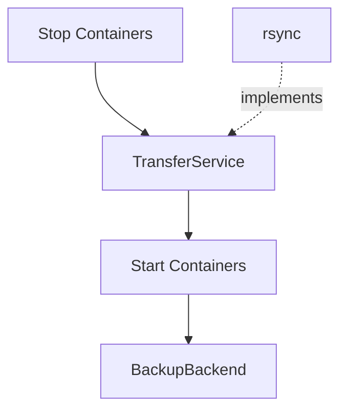
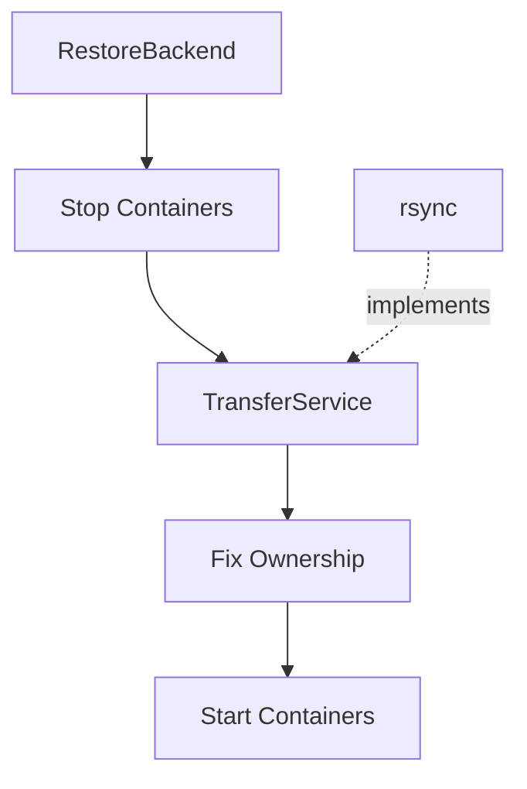

# AGENTS.md

## Project Overview

`dackup` is a Go CLI application for backing up and restoring Docker application data.

The application:

- Stops configured containers before staging data.
- Uses `TransferService` (currently implemented with `rsync`) to copy configured paths into a staging directory.
- Restarts containers immediately after staging completes to minimize downtime.
- Performs backups from the staged data using a backup backend.
- Restores staged data back to the live filesystem before restarting services.
- Fixes ownership with `chown` where appropriate.
- Restarts only containers that were stopped by the app.
- Supports interactive configuration management.
- Supports dry-run and verbose modes.

## Go Version

Use:

```bash
Go 1.26.0+
```

## Important Commands

Run formatting:

```bash
go fmt ./...
```

Run tests:

```bash
go test ./...
```

Build locally:

```bash
go build -o build/dackup .
```

## Current Architecture

The project is organized around top-level Cobra commands:

```text
.
├── cmd/
│ ├── backend/
│ │ ├── backend.go       # create/show/update/remove wiring
│ │ ├── borg.go           # borg settings prompt
│ │ ├── kopia.go          # kopia settings prompts, incl. per-storage-type
│ │ ├── prompts.go
│ │ ├── print.go
│ │ └── backend_test.go
│ ├── backup/
│ │ ├── backup.go          # runBackup + testable runBackupWithService core
│ │ ├── backup_test.go
│ │ └── orchestration_test.go
│ ├── config/
│ │ ├── config.go          # wiring + init/add/update/remove/list/use-file handlers
│ │ ├── prompts.go
│ │ ├── print.go
│ │ ├── config_helper.go   # thin shared.* compatibility shim
│ │ ├── config_test.go
│ │ ├── config_helper_test.go
│ │ └── orchestration_test.go
│ ├── restore/
│ │ ├── restore.go         # near-mirror of backup.go, reversed direction (see F015)
│ │ ├── restore_test.go
│ │ └── orchestration_test.go
│ ├── version/
│ │ ├── version.go
│ │ └── version_test.go
│ ├── fixtures_test.go
│ ├── root.go
│ └── root_test.go
├── internal/
│ ├── backend/
│ │ ├── backend.go        # Backend, GroupedBackend, BinaryChecker interfaces
│ │ ├── backend_test.go
│ │ ├── default/           # no-op Backend (package name defaultbackend)
│ │ │ ├── defaultbackend.go
│ │ │ └── defaultbackend_test.go
│ │ ├── borg/               # first concrete backend
│ │ │ ├── borg.go
│ │ │ └── borg_test.go
│ │ ├── kopia/               # second concrete backend
│ │ │ ├── kopia.go            # Config + consts
│ │ │ ├── backend.go          # Backend/GroupedBackend methods
│ │ │ ├── repository.go       # CLI mechanics per repository
│ │ │ ├── integration_helpers.go
│ │ │ ├── kopia_test.go
│ │ │ └── storage/            # one subpackage per storage type
│ │ │   ├── provider.go        # storage.Provider interface, Invocation, ObjectPrefix
│ │ │   ├── filesystem/
│ │ │   ├── s3/
│ │ │   ├── sftp/
│ │ │   ├── b2/
│ │ │   ├── azure/
│ │ │   ├── gcs/
│ │ │   ├── rclone/
│ │ │   └── webdav/
│ │ │     # each: <type>.go, <type>_test.go, and (except filesystem/rclone)
│ │ │     # integration_<type>_test.go behind //go:build integration
│ │ ├── factory.go
│ │ ├── factory_test.go
│ │ ├── registry.go
│ │ ├── registry_test.go
│ │ ├── settings.go
│ │ └── settings_test.go
│ └── shared/
│   ├── command_runner.go
│   ├── command_runner_test.go
│   ├── container_groups.go
│   ├── backend_groups_test.go
│   ├── container_groups_test.go
│   ├── container_lifecycle.go
│   ├── container_lifecycle_test.go
│   ├── container_selection.go
│   ├── docker.go
│   ├── filesystem.go
│   ├── logger.go
│   ├── paths.go
│   ├── preflight.go
│   ├── preflight_test.go
│   ├── prompts.go
│   ├── secrets.go
│   ├── secrets_test.go
│   ├── shared.go
│   ├── shared_test.go
│   ├── transfer.go
│   └── transfer_test.go
└── main.go
```

`internal/backend/kopia/storage/<type>/` is listed collapsed above since all seven follow the same shape — see AGENTS.md's "Backend interface" section below for the per-type detail. Everything else is listed exhaustively; regenerate this diagram (`find cmd internal main.go -name '*.go' | sort`) whenever it drifts rather than letting it go stale again.

Top-level command packages should expose constructors:

```go
func NewCommand(options *shared.Options) *cobra.Command
```

The root command wires commands together:

```go
rootCmd.AddCommand(backend.NewCommand(options))
rootCmd.AddCommand(backup.NewCommand(options))
rootCmd.AddCommand(config.NewCommand(options))
rootCmd.AddCommand(restore.NewCommand(options))
```

Avoid subcommand packages importing \`cmd\` directly. The dependency direction should be:

```text
main.go -> cmd
cmd/root.go -> cmd/backend, cmd/backup, cmd/config, cmd/restore
cmd/backend, cmd/backup, cmd/config, cmd/restore -> internal/shared
cmd/backend, cmd/backup, cmd/restore -> internal/backend
internal/backend -> internal/shared
```

Do not create import cycles.

## SOLID Refactor Decisions

The app was refactored toward SOLID principles.

### Single Responsibility

Shared infrastructure is split by concern:

- `command_runner.go` — command execution abstraction.
- `filesystem.go` — filesystem abstraction.
- `logger.go` — logging abstraction.
- `docker.go` — Docker CLI integration.
- `container_lifecycle.go` — stop/start orchestration.
- `container_selection.go` — container filtering and dependency selection.
- `paths.go` — path normalization and path resolution.
- `preflight.go` — prerequisite validation.
- `prompts.go` — interactive terminal prompting.
- `transfer.go` — staging data transfer and ownership operations.
- `shared.go` — shared config types and config file read/write helpers.

### Dependency Inversion

Command packages should depend on abstractions where practical:

```go
type CommandRunner interface {
    Run(name string, args ...string) error
    Output(name string, args ...string) ([]byte, error)
    LookPath(file string) (string, error)
}
```

```go
type FileSystem interface {
    Stat(name string) (os.FileInfo, error)
    MkdirAll(path string, perm os.FileMode) error
    OpenFile(name string, flag int, perm os.FileMode) (*os.File, error)
}
```

```go
type Logger interface {
    Log(level string, message string)
}
```

This makes services easier to test and keeps implementation details replaceable.

### Open/Closed

The command code should not directly call `exec.Command` for business operations.

Instead, use:

```go
shared.CommandRunner
shared.LoggedCommandRunner
shared.DockerService
shared.TransferService
shared.ContainerLifecycleService
```

This enables future changes such as replacing `rsync` with another staging implementation without rewriting the backup/restore workflow.

## TransferService and rsync

The project deliberately separates **staging** from **backup**.

`TransferService` is **not** the backup engine. Its responsibility is to create an isolated staging copy of the application data while minimizing container downtime.

The current implementation uses `rsync`, but `rsync` is considered an implementation detail of `TransferService`, not the backup mechanism itself.

The backup workflow is:



The restore workflow is the inverse:



This separation exists because:

- Container downtime should only include the time required to stage data.
- Long-running backup operations should never operate on live application data.
- Backup implementations should operate exclusively on the staging directory.
- `TransferService` and the backup backend solve different problems and should remain independent.

Future backup backends may include:

- Kopia
- Restic
- Borg
- Rsync

These are **backup implementations**, not replacements for `TransferService`.

Likewise, `TransferService` may eventually support alternative staging implementations (filesystem snapshots, reflinks, etc.) without affecting backup backends.

### Backend interface

`internal/backend/backend.go` defines a single, merged `Backend` interface — not a segregated `BackupBackend`/`RestoreBackend` pair (that split was the original plan but was superseded when `docs/backend.md` asked for one interface per backend implementation):

```go
type Backend interface {
    Name() string
    Backup(stagingDir string) error
    Restore(stagingDir string) error
}
```

It is deliberately config-agnostic: each concrete backend (rsync-as-backend, Borg, Kopia, ...) owns its own typed configuration and is constructed directly with its dependencies (`CommandRunner`, `Logger`, `Options`, ...), the same way `TransferService` is constructed today. Do not add a generic settings map (e.g. `map[string]any` or a `backends: {...}` config block) to carry backend-specific config — that was considered and rejected; each backend gets its own typed config struct when it's implemented.

`defaultbackend.Backend` (`internal/backend/defaultbackend/defaultbackend.go`) is a no-op implementation loaded whenever no backend is configured — its `Backup`/`Restore` just log and return `nil`. It lives in its own subpackage, same as every other concrete backend will (`internal/backend/borg/`, once it exists), so the folder structure stays consistent regardless of which backend you're looking at — `internal/backend` itself only ever holds the interface, factory, registry, and settings dispatch, never a concrete implementation. `backend.DefaultBackendName` re-exports `defaultbackend.Name` so callers only need to import the top-level `internal/backend` package. It is *not* selected by writing a `"none"` string anywhere: an empty/absent `Backend` config field is the only "unset" state, and `defaultbackend.Backend.Name()` returning `"none"` is display-only (used by `dackup backend show`).

`DackupConfig` (internal/shared/shared.go) carries `Backend string` and `BackendSettings json.RawMessage`, both `omitempty` — a config file with neither field is valid and means "use `DefaultBackend`". This is still not the rejected generic map: `BackendSettings` is opaque raw JSON in `internal/shared` (kept that way deliberately — see below), and `internal/backend.ParseSettings(backendName, raw)` dispatches on `Backend` to decode it into the matching backend's own typed `Config` struct, e.g. `internal/backend/borg.Config`. Each backend will live in its own subpackage under `internal/backend/<name>/` with its own `Config`, `DefaultConfig()`, `Validate()`, and `ParseConfig()` — adding a backend means adding a subpackage, registering its name in `internal/backend/registry.go`'s `AvailableBackends()`, and adding one `case` each to `settings.go` and `factory.go`, not changing the config shape. `internal/shared` never imports `internal/backend` or any backend subpackage, and never inspects `BackendSettings` beyond passing the bytes through: concrete backend implementations will need `CommandRunner`/`Logger`/`Options` from `internal/shared`, so `internal/backend -> internal/shared` is the anticipated dependency direction, and `internal/shared` importing back would set up a future cycle.

`internal/backend/factory.go`'s `Factory.GetBackend(name, settings)` is the construction entry point — it takes the same `CommandRunner`/`Logger`/`Options` dependencies `TransferService` takes, so a real backend's constructor slots in without changing the factory's signature.

`cmd/backend` is a CRUD-style command package (`create`/`show`/`update`/`remove`) mirroring `cmd/config`'s interactive style, for setting the `Backend`/`BackendSettings` fields on the main config file. `create`/`update` prompt for a backend name from `AvailableBackends()` (currently `"borg"` and `"kopia"`) and then that backend's settings; `show` masks any top-level `encrypted_*` field in `BackendSettings` before printing it, so a stored ciphertext (e.g. borg's `encrypted_passphrase` or kopia's `encrypted_password`) never appears verbatim.

`cmd/backup` and `cmd/restore` are wired to `internal/backend`. Each has its own `resolveBackend(service commandService, config shared.DackupConfig) (backend.Backend, error)` that builds a `Factory` from the same `CommandRunner`/`Logger`/`Options` the command's `TransferService` already uses, then calls `Factory.GetBackend(config.Backend, config.BackendSettings)`. It's called immediately after `newCommandService()`, before container filtering or preflight, so an unknown/unparseable backend name fails fast — no containers are touched.

The call into the resolved backend's `Backup`/`Restore` happens at the point the flowcharts above show, not adjacent to `resolveBackend`:

- `runBackup`: `backupBackend.Backup(backupDstDir)` is the *last* step, after `StartStoppedContainers` — so an arbitrarily slow backup never extends container downtime, and `backupDstDir` (the `TransferService` destination) is exactly the staging directory it operates on.
- `runRestore`: `restoreBackend.Restore(restoreSrcDir)` is called right after preflight but *before* `StopRunningContainers` — it populates the staging directory (`restoreSrcDir`, the `TransferService` source) from backend storage first, so the container-downtime-critical stop → stage → start sequence only starts once that data is already sitting on disk.

Both calls are unconditional — `cmd/backup`/`cmd/restore` never skip calling `Backup`/`Restore` based on `Options.DryRun`. Per [Dry Run Behavior](#dry-run-behavior), a concrete backend must check `Options.DryRun` itself before performing real work, the same way `TransferService`'s methods self-guard; `defaultbackend.Backend` doesn't need to since it never does anything.

`AvailableBackends()` now returns `["borg", "kopia"]`. `internal/backend/borg` is the first concrete backend: it implements both `Backend` (a single archive in the global repository, for callers that don't know about container groups) and the optional `GroupedBackend` interface — `BackupGroups`/`RestoreGroups`, taking `[]shared.BackendGroup` (deliberately defined in `internal/shared`, not `internal/backend`, so `internal/backend/borg` can reference it without importing `internal/backend`, which would cycle back through `Factory`). `cmd/backup`/`cmd/restore` type-assert the resolved `Backend` for `GroupedBackend` and prefer it when available, passing groups built from `shared.ContainerGroups` (connected components of the `contains` relationship, treated as undirected) via `shared.BackendGroupsFromContainerGroups`. Each group gets its own repository at `filepath.Join(BackendDir, group.Name)`; `BackupGroups` additionally archives everything into `filepath.Join(BackendDir, Config.GlobalRepoName)` (default `"global"`) as a full mirror — `RestoreGroups` never touches that repository, restoring only from each group's own. A borg passphrase is never stored in plaintext: `cmd/backend`'s prompt encrypts it via `shared.SecretStore` (`AESFileSecretStore`, AES-256-GCM keyed by `~/.config/dackup/secret.key`) before it's written to `encrypted_passphrase`, and `borg.Backend` decrypts it at call time to set `BORG_PASSPHRASE` on the `borg` subprocess via `shared.EnvCommandRunner` — a second, optional `CommandRunner` capability (`RunInDirWithEnv`/`OutputWithEnv`) added specifically because plain `CommandRunner` has no way to set environment variables or a working directory, both of which borg's `create`/`extract` need (relative paths + an explicit `cmd.Dir` avoid ambiguity around how borg strips leading slashes from absolute paths).

`internal/backend/kopia` is the second concrete backend, built the same way (`Backend` + `GroupedBackend`, same `Config`/`DefaultConfig()`/`Validate()`/`ParseConfig()` shape, same `shared.EnvCommandRunner`-based passphrase injection via `KOPIA_PASSWORD`, same `shared.SecretStore`-encrypted `encrypted_password` field), but its CLI shape forces two real differences from borg rather than a blind copy:

- **Kopia is always encrypted.** There's no `encryption` field or `"none"` mode like borg's — `kopia.Config.Validate()` always requires `encrypted_password`.
- **Kopia is connection-stateful, not stateless-per-invocation.** Borg takes a repository path directly on every `borg` call; kopia instead requires an explicit `repository create`/`repository connect` before any other command can touch a repository, with the connection scoped to a config file (`--config-file`). `kopia.Backend` gives every repository (each group's, plus the global one) its own config file under `filepath.Join(BackendDir, ".kopia-config", "<name>.config")`, always local regardless of where the repository *data* lives (see storage types below). Rather than tracking "does this repository already exist" per storage type — which would mean a different existence check for a local directory vs. an S3 bucket vs. an SFTP host — `Backend.ensureRepo` just tries `repository connect` first and falls back to `repository create` if that fails, the same "try connect, else init" idiom kopia's own non-interactive-setup docs use. This runs on every `Backup`/`Restore`/`BackupGroups`/`RestoreGroups` call rather than assuming a previous dackup run's config file survived on disk. `Backend.restoreRepo` uses the same connect attempt but never falls back to create — a restore against an unreachable repository just warns and is treated as "nothing to restore," matching the graceful-no-op behavior a `Stat`-based existence check gave the filesystem-only version of this code.
- **One kopia snapshot per source path, not one archive covering several.** `borg create` can archive several top-level paths into a single archive; `kopia snapshot create` only takes one source directory per invocation. So where borg's `BackupGroups` creates one archive per group containing all of that group's paths, `kopia.Backend`'s `BackupGroups` creates one snapshot per path within a group's repository (`RestoreGroups` mirrors this: it lists and restores the latest snapshot for each path individually via `kopia snapshot list <path> --json`/`kopia snapshot restore <id> <path>`). The plain (ungrouped) `Backup`/`Restore` fallback snapshots/restores `stagingDir` itself as a single source, matching borg's plain-fallback semantics of covering everything under `stagingDir` in one operation.

Optional per-repository compression is set as kopia's global policy (`kopia policy set --global --compression=<algo>`) right after each repository is created or connected, rather than passed as a `create`/`snapshot create` flag the way borg's `Config.Compression` is — kopia's compression is a repository policy, not a per-archive setting.

`kopia.Config.StorageType` selects where repository *data* lives, independent of the local `.kopia-config` directory above: `filesystem.Name` (the default, matching borg's local-directory-only model — `filepath.Join(BackendDir, name)`), `s3.Name`, `sftp.Name`, `b2.Name` (Backblaze's native API, not its S3-compatible endpoint), `azure.Name`, `gcs.Name`, `rclone.Name`, or `webdav.Name` — each a `= "<name>"` constant owned by that storage type's own subpackage (`internal/backend/kopia/storage/<name>`), the same pattern `internal/backend/borg.Name`/`internal/backend/kopia.Name` already use one level up for backend selection. `Config` holds one `*<name>.Storage` field per type (`S3 *s3.Storage`, `SFTP *sftp.Storage`, ..., all `omitempty`) rather than a generic map — the same reasoning applies one level down to storage-type selection as backend selection itself (see above). Remote types reuse a repository's name as an object-storage key prefix via `storage.ObjectPrefix` (`path.Join`, forward-slashed — these are storage keys, not local paths) rather than a directory, so several repositories can share one bucket/container/SFTP host/rclone remote. `webdav` is the one exception: its `--url` is a full URL with a `scheme://`, and `path.Join` would silently collapse that double slash (`path.Join("https://host/base", "repo")` → `"https:/host/base/repo"`), so `storage/webdav` has its own package-local `urlJoin` helper (plain string concatenation) instead of using the shared `storage.ObjectPrefix`. Credentials are handled per field, not uniformly: a value that's genuinely secret (S3's secret access key, B2's application key, Azure's storage key, SFTP's optional password, WebDAV's optional password) is `encrypted_*` via `shared.SecretStore` like kopia's own `encrypted_password`; a value that's just a filesystem path the operator already manages (SFTP's optional `keyfile_path`, GCS's `credentials_file_path`, rclone's optional `rclone_exe_path`/`config_file_path`) is stored as plain text, the same way borg's `Bin` is — encrypting a path would protect nothing, since the path itself isn't the secret. S3's credentials go out as `AWS_ACCESS_KEY_ID`/`AWS_SECRET_ACCESS_KEY` env vars (the AWS SDK's own convention, avoiding argv exposure); B2/Azure/SFTP/WebDAV pass their decrypted secret as an explicit kopia CLI flag instead, since (unlike S3/AWS) there's no universally documented env var kopia is guaranteed to honor for those providers — a known, accepted trade-off (briefly visible in process listing during that one command) rather than relying on unconfirmed behavior. `rclone` needs no secret from dackup at all: kopia reaches the remote by shelling out to the operator's own `rclone` binary, which resolves `rclone.Storage.RemoteName` against credentials already configured in `rclone.conf` (optionally a non-default one via `rclone.Storage.ConfigFilePath`, passed as the `RCLONE_CONFIG` env var — rclone's own convention) — dackup never sees or stores those credentials, the same way it never looks inside an SFTP keyfile or a GCS credentials file.

`internal/backend/kopia` is deliberately split one-package-per-responsibility rather than kept as a single `kopia.go` (it grew past 1000 lines once all seven storage types landed there, which is exactly the "bucket file" this repo's File Naming Guidelines warn against). Within the `kopia` package itself: `kopia.go` holds only `Config` and its top-level consts; `backend.go` holds the `Backend` type, its `backend.Backend`/`backend.GroupedBackend` methods, and its dependency defaults; `repository.go` holds the lower-level mechanics of driving the CLI against one named repository (`ensureRepo`, `connectArgs`/`createArgs`, snapshot create/list/restore). Storage types go a level further than file-per-responsibility — each is its own **subpackage** under `internal/backend/kopia/storage/`: `storage/s3`, `storage/sftp`, `storage/b2`, `storage/azure`, `storage/gcs`, `storage/rclone`, `storage/webdav`, and the built-in `storage/filesystem` (`filesystem.Name` has no JSON settings block of its own — `filesystem.Storage` just wraps `ReposRoot`, the one field it needs). A real Go package boundary (not just a filename convention) means one storage type's file can never accidentally reach into another's internals, `go test ./internal/backend/kopia/storage/s3/...` scopes to exactly one type, and each package's own `Storage` type is named plainly (`s3.Storage`, not `s3.S3Storage`) since the package name already disambiguates — avoiding the stutter `XStorage` naming had before this split.

Every leaf subpackage implements the `storage.Provider` interface (`internal/backend/kopia/storage/provider.go`: `Validate() error` plus `BuildInvocation(repoName string, secrets shared.SecretStore) (storage.Invocation, error)`), which lives in the parent `storage` package alongside the `storage.Invocation` result type and the shared `storage.ObjectPrefix` helper — every leaf package imports `storage`, `storage` imports none of them, so there's no cycle even though `internal/backend/kopia` itself imports both `storage` and every leaf. Before this interface existed, `StorageType` was switched on in two separate places — `Config.Validate()` (checking the right `*XStorage` field was non-nil) and `Backend.storageInvocation()` (building that type's CLI args) — that had to be kept in sync by hand on every change; that's a "Switch Statements" code smell (see the `solid` skill's code-smell list) as much as it's a DRY violation. `Config.provider(reposRoot string)` is now the *only* place that switches on `StorageType` (comparing against each leaf package's own `Name` constant), resolving it once into a `storage.Provider` that both `Validate()` and `Backend.storageInvocation()` call through — `Backend.storageInvocation` itself is now a five-line delegation to `backend.Config.provider(backend.ReposRoot).BuildInvocation(...)`. Adding an eighth storage type means: one new `storage/<name>` subpackage implementing `storage.Provider` (with its own `Name` constant, `Storage` struct, `Validate()`, `BuildInvocation()`, and `_test.go` testing the type directly — no `Backend`/CLI-runner fakes needed for that, since `BuildInvocation` only needs a `shared.SecretStore`), one field on `kopia.Config`, one case in `Config.provider`, and one `cmd/backend` prompt function — no existing storage type's package changes. The deliberate exceptions are in `Backend.createArgs`, for storage types kopia's own client doesn't prepare the target location for — confirmed by driving each against a real backing service, not assumed: `filesystem` (`MkdirAll` before `repository create`, since kopia's filesystem provider expects the target directory to already exist) and `webdav` (`webdav.Storage.EnsureCollection`, an HTTP `MKCOL` call before `repository create`, since kopia's webdav client — confirmed via a real WebDAV server's logs, which showed `PUT`/`GET`/`PROPFIND` but never `MKCOL` — never creates the target collection itself and just fails with a filesystem-level "no such file or directory", surfaced as an HTTP 403, the first time it tries to write into a directory that doesn't exist; a 405 from `MKCOL` means the collection already exists and isn't an error). Both need a capability (`shared.FileSystem`, an HTTP client) `storage.Provider` intentionally does not carry — adding either to the interface just for one provider would force the rest to carry a dependency they never use (Interface Segregation) — so both stay as explicit `switch invocation.Kind` cases in `Backend` (importing just those two leaf packages), not inside the interface.

## Docker Integration Decision

Use the Docker CLI for now, not the Docker socket/API.

Reasons:

- Smaller compiled binary.
- No Docker SDK dependency tree.
- Easier distribution.
- Consistent with existing external command usage.
- Current Docker operations are simple:
    - `docker ps`
    - `docker ps -a`
    - `docker stop`
    - `docker start`

Keep Docker access behind `DockerService`.

Future Podman support should be added by abstracting the engine command, for example:

```text
--container-engine docker
--container-engine podman
```

or via config:

```json
{ "container_engine": "podman" }
```

Do not switch to socket integration unless there is a strong reason.

## Shared Options

Global CLI flags are stored in:

```go
type Options struct {
    Verbose bool
    DryRun bool
}
```

Pass `*shared.Options` into command constructors.

Avoid direct cross-package globals.

## Command Registration

Do not register subcommands from package `init()` inside command packages.

Preferred:

```go
func NewCommand(options *shared.Options) *cobra.Command {
    cmd := &cobra.Command{ Use: "..." }
    return cmd
}
```

Then register in `cmd/root.go`.

## Backup/Restore Deduplication

Backup and restore share most mechanics:

- filtering selected containers,
- recursively including contained containers,
- stop/start lifecycle,
- preflight checks,
- path cleaning,
- staging via `TransferService`,
- logging.

Use shared services for these:

```go
shared.FilterContainerConfigs(...)
shared.ContainersToStopFromConfig(...)
shared.ContainerLifecycleService
shared.PreflightChecks(...)
shared.TransferService
```

Avoid duplicating equivalent logic between backup and restore packages.

## Config Command Notes

The config command currently keeps its subcommands in one package:

```text
cmd/config/
```

Possible future split:

```text
cmd/config/init/
cmd/config/add/
cmd/config/update/
cmd/config/remove/
cmd/config/list/
cmd/config/usefile/
```

But do not split these prematurely. They share prompt and config-writing logic. Prefer extracting shared services first.

The prompt logic lives in:

```text
internal/shared/prompts.go
```

It contains:

```go
PromptService
ParseStringList
```

## File Naming Guidelines

Use specific file names that describe one responsibility.

Good examples:

```text
command_runner.go
filesystem.go
logger.go
docker.go
container_lifecycle.go
container_selection.go
paths.go
preflight.go
prompts.go
transfer.go
backend.go
```

Avoid vague “bucket” files like:

```text
runtime.go
helpers.go
utils.go
common.go
```

unless there is a strong reason.

If creating a new file, explain why the file name was chosen.

## Tests

Keep tests close to the package they test:

```text
cmd/backup/backup_test.go
cmd/restore/restore_test.go
cmd/config/config_test.go
cmd/config/config_helper_test.go
cmd/root_test.go
```

For command package tests, prefer local test helpers instead of importing unexported helpers from another package.

Avoid tests depending on package-private symbols from unrelated packages.

`cmd/backup/orchestration_test.go` and `cmd/restore/orchestration_test.go` each define their own near-identical `fakeOrchestrationRunner`/`fakeOrchestrationLogger`/`fakeBinaryBackend`/`touchFile`/`containerFromFilterArg` — deliberate duplication, following the rule above, not an oversight. `internal/shared/container_lifecycle_test.go` has its own differently-shaped variant of the same runner/logger fake pattern for the same reason. Leave these as separate copies; do not extract a shared test-helper package across `cmd/backup`/`cmd/restore`/`internal/shared` to deduplicate them.

### Kopia storage integration tests

`internal/backend/kopia/storage/<type>/integration_<type>_test.go` (`storage/azure`, `storage/gcs`, `storage/s3`, `storage/sftp`, `storage/webdav`, beside each type's own `<type>_test.go`) drive the real `kopia` CLI against local emulator containers (`test/compose.yml`: `test_minio`, `test_sftp`, `test_webdav`, `test_azurite`, `test_gcs`) rather than fakes, one file per storage type, each behind a `//go:build integration` tag so the default `go test ./...` stays hermetic (no Docker or `kopia` binary required). Each is an external `<type>_test` package that imports `dackup/internal/backend/kopia` and drives it through exported, build-tag-gated helpers (`kopia.RequireKopiaBinary`, `kopia.LoadIntegrationConfig`, `kopia.NewIntegrationBackend`, `kopia.RunBackupRestoreRoundTrip`, ...) defined in `internal/backend/kopia/integration_helpers.go` — an ordinary (non-`_test.go`) file, because Go test files are only visible within their own package's test binary and these helpers need to be reachable from five different storage subpackages' test binaries. Run them with:

```bash
docker compose -f test/compose.yml up -d
go test -tags=integration ./internal/backend/kopia/...
```

Each test skips (not fails) if the `kopia` binary or its target container isn't reachable, so this degrades cleanly without the containers running. Fixtures live at `test/config.<type>.json`, decrypted via a dedicated, repo-committed `test/secret.key` — never the real `~/.config/dackup/secret.key` — so they're portable across machines rather than tied to whoever generated them. Because kopia keys a repository's snapshots by the literal source path string given to `snapshot create`, each test's round-trip helper backs up and restores using the *same* directory (matching real dackup usage, where restore always writes back into the same `data_dir` a backup came from) rather than two different temp dirs.

Every CLI flag `internal/backend/kopia/storage/*` sends to `kopia` was verified against a real `kopia repository create <type> --help` (not just written from memory) — this caught one real bug: SFTP's password flag is `--sftp-password`, not `--password` (reserved for the repository password itself). Two storage types remain genuinely uncertain even with correct flags, and their integration tests say so:

- **azure** (`storage/azure`): `--storage-domain` overrides the domain in an otherwise virtual-hosted-style URL, but Azurite serves path-style URLs instead — this may not actually reach Azurite even though the flag itself is real.
- **gcs** (`storage/gcs`): kopia documents no endpoint-override flag for GCS; `EmulatorHost` sets `STORAGE_EMULATOR_HOST`, a convention Google's own client libraries respect, betting kopia's GCS backend uses one under the hood — unconfirmed.

## Compatibility Wrappers

Some unexported wrapper functions remain for tests and package compatibility, for example:

```go
filterConfigsForBackup(...)
containersToStopFromConfig(...)
cleanConfiguredPath(...)
```

These should delegate to shared services rather than contain duplicated logic.

Example:

```go
func filterConfigsForBackup(configs []shared.ContainerConfig, requestedContainers []string) ([]shared.ContainerConfig, error) {
    return shared.FilterContainerConfigs(configs, requestedContainers, "backup")
}
```

## Dry Run Behavior

Dry-run should not:

- write config files,
- create directories,
- perform staging transfers,
- invoke backup backends,
- stop containers,
- start containers,
- run `chown`.

It should log/print what would happen.

"Invoke backup backends" means *perform real backend work*, not "never call the method": `cmd/backup`/`cmd/restore` always call `Backend.Backup()`/`Restore()` unconditionally (see the "Backend interface" section above) — it's the concrete backend's own responsibility to check `Options.DryRun` and log a preview instead of running its actual backup/restore command, the same self-guarding convention `TransferService`'s methods already follow. `defaultbackend.Backend` satisfies this trivially since it never does real work either way.

Always check:

```go
if options != nil && options.DryRun {
    // preview action
}
```

## Verbose Behavior

Verbose should print commands before running them.

Use `LoggedCommandRunner` for command execution that needs logging and verbose behavior.

## Root Privileges

`backup`/`restore` no longer enforce `os.Geteuid() == 0`. They run as whatever user invokes them; if that user lacks permission to stop/start the configured Docker containers or to `chown` files to the configured `user`/`group`, those steps fail with a normal error at the point they're attempted rather than being gated upfront. Do not reintroduce a root check without discussing it first — this was a deliberate removal, not an oversight.

## Config Files

The default config path is:

```text
~/.config/dackup/config.json
```

Shared config helpers live in \`internal/shared/shared.go\`.

Primary types:

```go
type ContainerConfig struct {
    Container string `json:"container"`
    ToStop bool `json:"to_stop"`
    Paths []string `json:"paths,omitempty"`
    Contains []string `json:"contains,omitempty"`
}
```

```go
type DackupConfig struct {
    User string `json:"user,omitempty"`
    Group string `json:"group,omitempty"`
    ConfigFile string `json:"config_file,omitempty"`
    DataDir string `json:"data_dir,omitempty"`
    StagingDir string `json:"staging_dir,omitempty"`
    BackendDir string `json:"backend_dir,omitempty"`
    Containers []ContainerConfig `json:"containers,omitempty"`
}
```

## Safety Notes

Be careful with restore behavior. Restoring staged data back to the live filesystem may overwrite or delete existing files depending on the transfer implementation.

Preserve dry-run functionality for destructive operations.

## After Any Refactor

Always run:

```bash
go fmt ./...
go test ./...
```

If available, also run the Makefile test target:

```bash
make test
```
