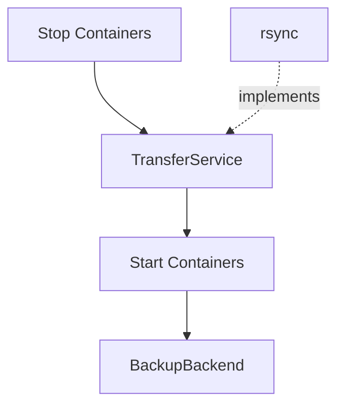
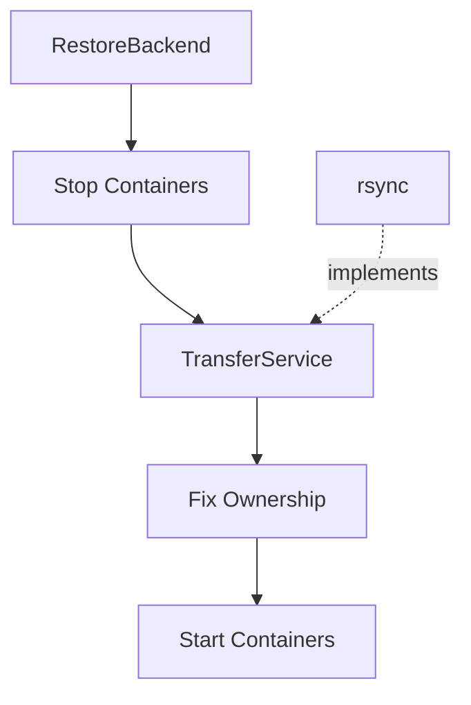

# AGENTS.md

## Project Overview

`dackup` is a Go CLI application for backing up and restoring Docker application data.

The application:

- Stops configured containers before staging data.
- Uses `TransferService` (currently implemented with `rsync`) to copy configured paths into a staging directory.
- Restarts containers immediately after staging completes to minimize downtime.
- Performs backups from the staged data using a backup backend.
- Restores staged data back to the live filesystem before restarting services.
- Fixes ownership with `chown` where appropriate.
- Restarts only containers that were stopped by the app.
- Supports interactive configuration management.
- Supports dry-run and verbose modes.

## Go Version

Use:

```bash
Go 1.26.0+
```

## Important Commands

Run formatting:

```bash
go fmt ./...
```

Run tests:

```bash
go test ./...
```

Build locally:

```bash
go build -o build/dackup .
```

## Current Architecture

The project is organized around top-level Cobra commands:

```text
.
├── cmd/
│ ├── backend/
│ │ ├── backend.go
│ │ └── backend_test.go
│ ├── backup/
│ │ ├── backup.go
│ │ └── backup_test.go
│ ├── config/
│ │ ├── config.go
│ │ ├── config_helper.go
│ │ ├── config_helper_test.go
│ │ └── config_test.go
│ ├── restore/
│ │ ├── restore.go
│ │ └── restore_test.go
│ ├── fixtures_test.go
│ ├── root.go
│ └── root_test.go
├── internal/
│ ├── backend/
│ │ ├── backend.go
│ │ ├── backend_test.go
│ │ ├── defaultbackend/
│ │ │ ├── defaultbackend.go
│ │ │ └── defaultbackend_test.go
│ │ ├── factory.go
│ │ ├── factory_test.go
│ │ ├── registry.go
│ │ ├── registry_test.go
│ │ ├── settings.go
│ │ └── settings_test.go
│ └── shared/
│   ├── command_runner.go
│   ├── container_lifecycle.go
│   ├── container_selection.go
│   ├── docker.go
│   ├── filesystem.go
│   ├── logger.go
│   ├── paths.go
│   ├── preflight.go
│   ├── prompts.go
│   ├── shared.go
│   ├── shared_test.go
│   └── transfer.go
└── main.go
```

Top-level command packages should expose constructors:

```go
func NewCommand(options *shared.Options) *cobra.Command
```

The root command wires commands together:

```go
rootCmd.AddCommand(backend.NewCommand(options))
rootCmd.AddCommand(backup.NewCommand(options))
rootCmd.AddCommand(config.NewCommand(options))
rootCmd.AddCommand(restore.NewCommand(options))
```

Avoid subcommand packages importing \`cmd\` directly. The dependency direction should be:

```text
main.go -> cmd
cmd/root.go -> cmd/backend, cmd/backup, cmd/config, cmd/restore
cmd/backend, cmd/backup, cmd/config, cmd/restore -> internal/shared
cmd/backend, cmd/backup, cmd/restore -> internal/backend
internal/backend -> internal/shared
```

Do not create import cycles.

## SOLID Refactor Decisions

The app was refactored toward SOLID principles.

### Single Responsibility

Shared infrastructure is split by concern:

- `command_runner.go` — command execution abstraction.
- `filesystem.go` — filesystem abstraction.
- `logger.go` — logging abstraction.
- `docker.go` — Docker CLI integration.
- `container_lifecycle.go` — stop/start orchestration.
- `container_selection.go` — container filtering and dependency selection.
- `paths.go` — path normalization and path resolution.
- `preflight.go` — prerequisite validation.
- `prompts.go` — interactive terminal prompting.
- `transfer.go` — staging data transfer and ownership operations.
- `shared.go` — shared config types and config file read/write helpers.

### Dependency Inversion

Command packages should depend on abstractions where practical:

```go
type CommandRunner interface {
    Run(name string, args ...string) error
    Output(name string, args ...string) ([]byte, error)
    LookPath(file string) (string, error)
}
```

```go
type FileSystem interface {
    Stat(name string) (os.FileInfo, error)
    MkdirAll(path string, perm os.FileMode) error
    OpenFile(name string, flag int, perm os.FileMode) (*os.File, error)
}
```

```go
type Logger interface {
    Log(level string, message string)
}
```

This makes services easier to test and keeps implementation details replaceable.

### Open/Closed

The command code should not directly call `exec.Command` for business operations.

Instead, use:

```go
shared.CommandRunner
shared.LoggedCommandRunner
shared.DockerService
shared.TransferService
shared.ContainerLifecycleService
```

This enables future changes such as replacing `rsync` with another staging implementation without rewriting the backup/restore workflow.

## TransferService and rsync

The project deliberately separates **staging** from **backup**.

`TransferService` is **not** the backup engine. Its responsibility is to create an isolated staging copy of the application data while minimizing container downtime.

The current implementation uses `rsync`, but `rsync` is considered an implementation detail of `TransferService`, not the backup mechanism itself.

The backup workflow is:



The restore workflow is the inverse:



This separation exists because:

- Container downtime should only include the time required to stage data.
- Long-running backup operations should never operate on live application data.
- Backup implementations should operate exclusively on the staging directory.
- `TransferService` and the backup backend solve different problems and should remain independent.

Future backup backends may include:

- Kopia
- Restic
- Borg
- Rsync

These are **backup implementations**, not replacements for `TransferService`.

Likewise, `TransferService` may eventually support alternative staging implementations (filesystem snapshots, reflinks, etc.) without affecting backup backends.

### Backend interface

`internal/backend/backend.go` defines a single, merged `Backend` interface — not a segregated `BackupBackend`/`RestoreBackend` pair (that split was the original plan but was superseded when `docs/backend.md` asked for one interface per backend implementation):

```go
type Backend interface {
    Name() string
    Backup(stagingDir string) error
    Restore(stagingDir string) error
}
```

It is deliberately config-agnostic: each concrete backend (rsync-as-backend, Borg, Kopia, ...) owns its own typed configuration and is constructed directly with its dependencies (`CommandRunner`, `Logger`, `Options`, ...), the same way `TransferService` is constructed today. Do not add a generic settings map (e.g. `map[string]any` or a `backends: {...}` config block) to carry backend-specific config — that was considered and rejected; each backend gets its own typed config struct when it's implemented.

`defaultbackend.Backend` (`internal/backend/defaultbackend/defaultbackend.go`) is a no-op implementation loaded whenever no backend is configured — its `Backup`/`Restore` just log and return `nil`. It lives in its own subpackage, same as every other concrete backend will (`internal/backend/borg/`, once it exists), so the folder structure stays consistent regardless of which backend you're looking at — `internal/backend` itself only ever holds the interface, factory, registry, and settings dispatch, never a concrete implementation. `backend.DefaultBackendName` re-exports `defaultbackend.Name` so callers only need to import the top-level `internal/backend` package. It is *not* selected by writing a `"none"` string anywhere: an empty/absent `Backend` config field is the only "unset" state, and `defaultbackend.Backend.Name()` returning `"none"` is display-only (used by `dackup backend show`).

`DackupConfig` (internal/shared/shared.go) carries `Backend string` and `BackendSettings json.RawMessage`, both `omitempty` — a config file with neither field is valid and means "use `DefaultBackend`". This is still not the rejected generic map: `BackendSettings` is opaque raw JSON in `internal/shared` (kept that way deliberately — see below), and `internal/backend.ParseSettings(backendName, raw)` dispatches on `Backend` to decode it into the matching backend's own typed `Config` struct, e.g. `internal/backend/borg.Config`. Each backend will live in its own subpackage under `internal/backend/<name>/` with its own `Config`, `DefaultConfig()`, `Validate()`, and `ParseConfig()` — adding a backend means adding a subpackage, registering its name in `internal/backend/registry.go`'s `AvailableBackends()`, and adding one `case` each to `settings.go` and `factory.go`, not changing the config shape. `internal/shared` never imports `internal/backend` or any backend subpackage, and never inspects `BackendSettings` beyond passing the bytes through: concrete backend implementations will need `CommandRunner`/`Logger`/`Options` from `internal/shared`, so `internal/backend -> internal/shared` is the anticipated dependency direction, and `internal/shared` importing back would set up a future cycle.

`internal/backend/factory.go`'s `Factory.GetBackend(name, settings)` is the construction entry point — it takes the same `CommandRunner`/`Logger`/`Options` dependencies `TransferService` takes, so a real backend's constructor slots in without changing the factory's signature. As of now `AvailableBackends()` returns nothing (**no concrete implementation** exists yet), so `Factory.GetBackend` only ever resolves to `defaultbackend.Backend`.

`cmd/backend` is a new CRUD-style command package (`create`/`show`/`update`/`remove`) mirroring `cmd/config`'s interactive style, for setting the `Backend`/`BackendSettings` fields on the main config file. Because no concrete backend is registered yet, `create`/`update` currently just report that nothing is implemented rather than writing anything.

`cmd/backup` and `cmd/restore` are wired to `internal/backend`. Each has its own `resolveBackend(service commandService, config shared.DackupConfig) (backend.Backend, error)` that builds a `Factory` from the same `CommandRunner`/`Logger`/`Options` the command's `TransferService` already uses, then calls `Factory.GetBackend(config.Backend, config.BackendSettings)`. It's called immediately after `newCommandService()`, before container filtering or preflight, so an unknown/unparseable backend name fails fast — no containers are touched.

The call into the resolved backend's `Backup`/`Restore` happens at the point the flowcharts above show, not adjacent to `resolveBackend`:

- `runBackup`: `backupBackend.Backup(backupDstDir)` is the *last* step, after `StartStoppedContainers` — so an arbitrarily slow backup never extends container downtime, and `backupDstDir` (the `TransferService` destination) is exactly the staging directory it operates on.
- `runRestore`: `restoreBackend.Restore(restoreSrcDir)` is called right after preflight but *before* `StopRunningContainers` — it populates the staging directory (`restoreSrcDir`, the `TransferService` source) from backend storage first, so the container-downtime-critical stop → stage → start sequence only starts once that data is already sitting on disk.

Both calls are unconditional — `cmd/backup`/`cmd/restore` never skip calling `Backup`/`Restore` based on `Options.DryRun`. Per [Dry Run Behavior](#dry-run-behavior), a concrete backend must check `Options.DryRun` itself before performing real work, the same way `TransferService`'s methods self-guard; `defaultbackend.Backend` doesn't need to since it never does anything.

Since `AvailableBackends()` still returns nothing, `Factory.GetBackend` still only ever resolves to `defaultbackend.Backend` in practice — the wiring is live, but there is still no concrete backend implementation to exercise it (Borg is the intended first one).

## Docker Integration Decision

Use the Docker CLI for now, not the Docker socket/API.

Reasons:

- Smaller compiled binary.
- No Docker SDK dependency tree.
- Easier distribution.
- Consistent with existing external command usage.
- Current Docker operations are simple:
    - `docker ps`
    - `docker ps -a`
    - `docker stop`
    - `docker start`

Keep Docker access behind `DockerService`.

Future Podman support should be added by abstracting the engine command, for example:

```text
--container-engine docker
--container-engine podman
```

or via config:

```json
{ "container_engine": "podman" }
```

Do not switch to socket integration unless there is a strong reason.

## Shared Options

Global CLI flags are stored in:

```go
type Options struct {
    Verbose bool
    DryRun bool
}
```

Pass `*shared.Options` into command constructors.

Avoid direct cross-package globals.

## Command Registration

Do not register subcommands from package `init()` inside command packages.

Preferred:

```go
func NewCommand(options *shared.Options) *cobra.Command {
    cmd := &cobra.Command{ Use: "..." }
    return cmd
}
```

Then register in `cmd/root.go`.

## Backup/Restore Deduplication

Backup and restore share most mechanics:

- filtering selected containers,
- recursively including contained containers,
- stop/start lifecycle,
- preflight checks,
- path cleaning,
- staging via `TransferService`,
- logging.

Use shared services for these:

```go
shared.FilterContainerConfigs(...)
shared.ContainersToStopFromConfig(...)
shared.ContainerLifecycleService
shared.PreflightChecks(...)
shared.TransferService
```

Avoid duplicating equivalent logic between backup and restore packages.

## Config Command Notes

The config command currently keeps its subcommands in one package:

```text
cmd/config/
```

Possible future split:

```text
cmd/config/init/
cmd/config/add/
cmd/config/update/
cmd/config/remove/
cmd/config/list/
cmd/config/usefile/
```

But do not split these prematurely. They share prompt and config-writing logic. Prefer extracting shared services first.

The prompt logic lives in:

```text
internal/shared/prompts.go
```

It contains:

```go
PromptService
ParseStringList
```

## File Naming Guidelines

Use specific file names that describe one responsibility.

Good examples:

```text
command_runner.go
filesystem.go
logger.go
docker.go
container_lifecycle.go
container_selection.go
paths.go
preflight.go
prompts.go
transfer.go
backend.go
```

Avoid vague “bucket” files like:

```text
runtime.go
helpers.go
utils.go
common.go
```

unless there is a strong reason.

If creating a new file, explain why the file name was chosen.

## Tests

Keep tests close to the package they test:

```text
cmd/backup/backup_test.go
cmd/restore/restore_test.go
cmd/config/config_test.go
cmd/config/config_helper_test.go
cmd/root_test.go
```

For command package tests, prefer local test helpers instead of importing unexported helpers from another package.

Avoid tests depending on package-private symbols from unrelated packages.

## Compatibility Wrappers

Some unexported wrapper functions remain for tests and package compatibility, for example:

```go
filterConfigsForBackup(...)
containersToStopFromConfig(...)
cleanConfiguredPath(...)
```

These should delegate to shared services rather than contain duplicated logic.

Example:

```go
func filterConfigsForBackup(configs []shared.ContainerConfig, requestedContainers []string) ([]shared.ContainerConfig, error) {
    return shared.FilterContainerConfigs(configs, requestedContainers, "backup")
}
```

## Dry Run Behavior

Dry-run should not:

- write config files,
- create directories,
- perform staging transfers,
- invoke backup backends,
- stop containers,
- start containers,
- run `chown`.

It should log/print what would happen.

"Invoke backup backends" means *perform real backend work*, not "never call the method": `cmd/backup`/`cmd/restore` always call `Backend.Backup()`/`Restore()` unconditionally (see the "Backend interface" section above) — it's the concrete backend's own responsibility to check `Options.DryRun` and log a preview instead of running its actual backup/restore command, the same self-guarding convention `TransferService`'s methods already follow. `defaultbackend.Backend` satisfies this trivially since it never does real work either way.

Always check:

```go
if options != nil && options.DryRun {
    // preview action
}
```

## Verbose Behavior

Verbose should print commands before running them.

Use `LoggedCommandRunner` for command execution that needs logging and verbose behavior.

## Root Privileges

`backup`/`restore` no longer enforce `os.Geteuid() == 0`. They run as whatever user invokes them; if that user lacks permission to stop/start the configured Docker containers or to `chown` files to the configured `user`/`group`, those steps fail with a normal error at the point they're attempted rather than being gated upfront. Do not reintroduce a root check without discussing it first — this was a deliberate removal, not an oversight.

## Config Files

The default config path is:

```text
~/.config/dackup/config.json
```

Shared config helpers live in \`internal/shared/shared.go\`.

Primary types:

```go
type ContainerConfig struct {
    Container string `json:"container"`
    ToStop bool `json:"to_stop"`
    Paths []string `json:"paths,omitempty"`
    Contains []string `json:"contains,omitempty"`
}
```

```go
type DackupConfig struct {
    User string `json:"user,omitempty"`
    Group string `json:"group,omitempty"`
    ConfigFile string `json:"config_file,omitempty"`
    BackupSrcDir string `json:"backup_src_dir,omitempty"`
    BackupDstDir string `json:"backup_dst_dir,omitempty"`
    Containers []ContainerConfig `json:"containers,omitempty"`
}
```

## Safety Notes

Be careful with restore behavior. Restoring staged data back to the live filesystem may overwrite or delete existing files depending on the transfer implementation.

Preserve dry-run functionality for destructive operations.

## After Any Refactor

Always run:

```bash
go fmt ./...
go test ./...
```

If available, also run the Makefile test target:

```bash
make test
```
