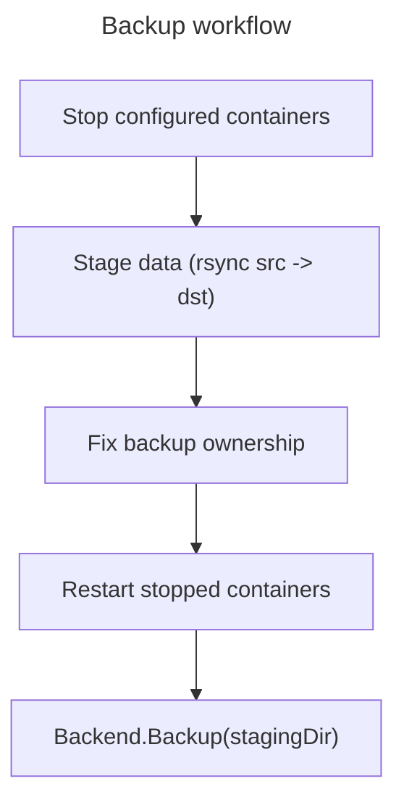
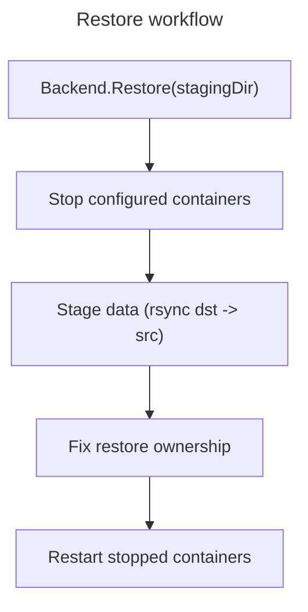

# dackup

`dackup` is a small CLI application for backing up and restoring Docker application data with `rsync`.

It can stop selected Docker containers, copy configured application directories, fix file ownership, and restart only the containers that were actually stopped.

## Features

- Back up Docker application data from a source directory to a backup directory.
- Restore Docker application data from a backup directory to the application directory.
- Stop configured containers before backup or restore.
- Restart only containers that were stopped by `dackup`.
- Select one or more containers to back up or restore.
- Automatically include dependent containers declared with `contains`.
- Manage configuration interactively.
- Store container configuration directly in the main config file or in a custom config file.
- Preview actions with `--dry-run`.
- Enable command output with `--verbose`.

## Workflow

Backup stages data first, then restarts containers before handing off to the backup backend — so a slow backend never extends container downtime:



Restore is the mirror image, but the backend runs *first* — it pulls data into the staging directory before any container is touched, so the actual downtime-critical stop/stage/start sequence only starts once that data is already on disk:



The backend step is wired up (`dackup backend create`/`show`/`update`/`remove` manage it). Borg is the first concrete backend: with `backend: "borg"` configured, `backup` archives each container group (containers linked via `contains` share one repository) plus a full mirror into a separate global repository, both under `backend_dir`; `restore` extracts each group's latest archive back out. Leaving `backend` unset keeps the no-op default.

## Requirements

- Go 1.26.2 or newer
- Docker CLI
- rsync
- Sufficient privileges to manage the configured Docker containers and to `chown` files to the configured `user`/`group`

## Installation

Install dependencies when possible:

```bash
make deps
```

Build the binary:

```bash
make build
```

Install it to `/usr/sbin/dackup`:

```bash
make install
```

Uninstall it:

```bash
make uninstall
```

Clean build artifacts:

```bash
make clean
```

## Configuration

The default configuration file is:

```text
~/.config/dackup/config.json
```

Create it interactively:

```bash
dackup config init
```

Add a container interactively:

```bash
dackup config add
```

Update an existing container interactively:

```bash
dackup config update
```

Remove an existing container interactively:

```bash
dackup config remove
```

List configured containers:

```bash
dackup config list
```

Use a custom containers configuration file:

```bash
dackup config use-file /path/to/containers.json
```

You can also choose a custom main configuration file with:

```bash
dackup config --config-file /path/to/config.json init
```

## Configuration format

Example configuration:

```json
{
  "user": "appuser",
  "group": "appgroup",
  "data_dir": "/opt/apps_docker",
  "staging_dir": "/backups/in",
  "containers": [
    {
      "container": "paperless",
      "to_stop": true,
      "paths": [
        "/data/paperless",
        "/config/paperless"
      ],
      "contains": [
        "paperless_db",
        "paperless_broker"
      ]
    },
    {
      "container": "paperless_db",
      "to_stop": true,
      "paths": [
        "/data/paperless_db"
      ]
    },
    {
      "container": "adguard",
      "to_stop": true,
      "paths": [
        "/config/adguard"
      ]
    }
  ]
}
```

### Fields

| Field | Description |
| --- | --- |
| `user` | Owner user applied to backed up or restored files. |
| `group` | Owner group applied to backed up or restored files. |
| `data_dir` | Live application data root. Source for `backup`; default destination root for `restore`. |
| `staging_dir` | Staging root used for the rsync transfer. Destination for `backup`; default source root for `restore`. |
| `backend_dir` | Optional durable storage root for the configured backup backend (e.g. Borg repositories). Unused by the default no-op backend. |
| `config_file` | Optional path to another config file containing `containers`. |
| `containers` | List of configured Docker containers. |
| `container` | Docker container name. |
| `to_stop` | Whether the container should be stopped before backup or restore. |
| `paths` | Paths to back up and restore, relative to the configured source/destination roots. Absolute-looking paths are cleaned and treated relative to those roots. |
| `contains` | Dependent containers to include automatically when this container is selected. |

## Backup

Default backup paths:

- Source root: `/opt/apps_docker`
- Destination root: `/backups/in`
- Log file: `/var/log/docker-backup.log`

Back up all configured containers:

```bash
dackup backup
```

Back up one container:

```bash
dackup backup paperless
```

Back up multiple containers:

```bash
dackup backup paperless adguard
```

Use custom paths:

```bash
dackup backup \
  --src-dir /opt/apps_docker \
  --dst-dir /backups/in \
  --log-file /var/log/docker-backup.log
```

Use a custom config file:

```bash
dackup backup --config-file /path/to/config.json
```

## Restore

Default restore paths:

- Source root: `/backups/in`
- Destination root: `/opt/apps_docker`
- Log file: `/var/log/docker-restore.log`

Restore all configured containers:

```bash
dackup restore
```

Restore one container:

```bash
dackup restore paperless
```

Restore multiple containers:

```bash
dackup restore paperless adguard
```

Use custom paths:

```bash
dackup restore \
  --src-dir /backups/in \
  --dst-dir /opt/apps_docker \
  --log-file /var/log/docker-restore.log
```

Use a custom config file:

```bash
dackup restore --config-file /path/to/config.json
```

## Global flags

Use verbose output:

```bash
dackup --verbose backup
```

Preview actions without writing files or stopping containers:

```bash
dackup --dry-run backup
```

The short forms are also available:

```bash
dackup -v backup
dackup -d backup
```

## How paths are resolved

For backup, each configured path is resolved under `--src-dir` and copied to the same relative path under `--dst-dir`.

Example:

```json
{
  "paths": ["/data/paperless"]
}
```

With default backup directories, this copies:

```text
/opt/apps_docker/data/paperless
```

to:

```text
/backups/in/data/paperless
```

For restore, the direction is reversed:

```text
/backups/in/data/paperless
```

to:

```text
/opt/apps_docker/data/paperless
```

## Development

Run tests:

```bash
make test
```

Or directly:

```bash
go test ./...
```

Build locally:

```bash
go build -o build/dackup .
```

## Safety notes

- Run backup and restore as a user with permission to manage the configured Docker containers and to `chown` files to the configured `user`/`group` — often root, but no longer enforced by dackup itself.
- Make sure Docker container names match the names in your configuration.
- Use `--dry-run` before running a backup or restore for the first time.
- Restore uses `rsync -a --delete`, so destination files not present in the backup source can be removed.

# TODO
Here is a list of todo things that should be implemented :
- [ ] Use backend for backup usage:
  - [ ] rclone
  - [x] Borg
  - [ ] Kopia
  - [ ] resting
- [ ] Add podman integration, not only docker
- [ ] More ... ?