As a User, I want to be able to connect my `backup` and `restore` to a Backup Backend like `Borg`, `Kopia` or `rsync`.

## Status

Implemented (this document reflects the actual code, not just the original ask):

- `../internal/backend` — the `Backend` interface, `Factory`, `AvailableBackends()`, `ParseSettings`. `../internal/backend/default` — the no-op `Backend` implementation, kept in its own subpackage.
- `internal/shared.DackupConfig` — optional `Backend`/`BackendSettings` fields, plus a top-level `BackendDir` (repository storage root, alongside `data_dir`/`staging_dir`).
- `dackup backend` — the `create`/`show`/`update`/`remove` CRUD command, including an interactive borg settings prompt and masking of any stored `encrypted_*` field on `show`.
- `dackup backup`/`dackup restore` — wired to `Factory.GetBackend` and call `Backend.Backup()`/`Backend.Restore()`, or the richer `GroupedBackend.BackupGroups()`/`RestoreGroups()` when the resolved backend implements it (see "Wiring into backup/restore" below for the exact call sites).
- `../internal/backend/borg` — the first concrete backend. One repository per container group (containers linked via `contains`, connected components treated as undirected — see `shared.ContainerGroups`), plus one full-mirror global repository. Passphrases are never stored in plaintext: `shared.SecretStore` (`AESFileSecretStore`, AES-256-GCM) encrypts them before they're written to `encrypted_passphrase` and decrypts them at call time to set `BORG_PASSPHRASE`.

Not implemented yet:

- Other backends (Kopia, rsync-as-backend, rclone, ...) — `AvailableBackends()` currently returns only `["borg"]`.
- Restoring from the global (full-mirror) repository — `RestoreGroups` only ever restores from each group's own repository today.

## One interface, not one per direction

The original idea sketched a `IBackend` interface with `Backup()`/`Restore()`. The as-built interface keeps that shape but is named `Backend` (idiomatic Go — no `I` prefix), and stays a single merged interface rather than splitting into separate backup/restore interfaces, so one backend implementation only ever has one type to satisfy:

```go
type Backend interface {
    Name() string
    Backup(stagingDir string) error
    Restore(stagingDir string) error
}
```

`defaultbackend.Backend` (`../internal/backend/defaultbackend/defaultbackend.go`) is the no-op implementation loaded whenever no backend is configured, kept in its own subpackage rather than inside `internal/backend` itself — same as every other concrete backend will be (see "Folder structure" below). Its `Name()` returns `"none"`, but that string is **display-only** (printed by `dackup backend show`) — it is never written to the config file. The only "no backend configured" state is an empty/absent `backend` field. `backend.DefaultBackendName` re-exports `defaultbackend.Name` from the top-level package for convenience.

## Config file shape

Saved on the main config file (`~/.config/dackup/config.json` by default), alongside `user`/`group`/the dir defaults — same file, no separate backend config file:

```json
{
  "backend": "backendName",
  "backend_settings": {
    "setting1": "setting",
    "setting2": "setting"
  }
}
```

Both fields are optional (`omitempty` on `shared.DackupConfig`). A config with neither field is valid — it means "use the default no-op backend". `backend_settings` is stored as opaque raw JSON in `../internal/shared` (`json.RawMessage`); `../internal/shared` never inspects it beyond passing the bytes through, so adding a backend never changes `DackupConfig`'s shape.

A third top-level field, `backend_dir`, sits alongside `data_dir`/`staging_dir` rather than inside `backend_settings` — it's the repository storage root a backend like borg needs, and `PreflightChecks` (which only ever sees `shared.DackupConfig`, not a parsed `backend_settings`) needs to validate it exists without importing `internal/backend` — putting it inside opaque `backend_settings` JSON would make that impossible without inverting the `internal/backend -> internal/shared` dependency direction.

## How a concrete backend gets resolved

Two separate dispatch points, both switching on the backend name, exist so that adding a backend is "add a subpackage, register its name, add one case to each":

- `../internal/backend/registry.go` — `AvailableBackends() []string` lists the names selectable via `dackup backend create`/`update`. Currently returns `["borg"]`.
- `../internal/backend/settings.go` — `ParseSettings(name string, raw json.RawMessage) (any, error)` decodes `backend_settings` into the matching backend's own typed `Config` struct. For `""` it returns `nil, nil`; for `"borg"` it returns a `borg.Config` via `borg.ParseConfig`; any other name is `"unknown backend"`.
- `../internal/backend/factory.go` — `Factory.GetBackend(name string, settings json.RawMessage) (Backend, error)` is the actual construction entry point: given a name and its raw settings, it returns a ready-to-use `Backend`. It carries the same dependencies `shared.TransferService` takes (`CommandRunner`, `Logger`, `Options`), plus `BackendDir` (the top-level `DackupConfig.BackendDir`) and `Secrets` (a `shared.SecretStore`), so a real backend's constructor slots in without changing the factory's signature. `""` resolves to `defaultbackend.Backend{Logger: factory.Logger}`; `"borg"` resolves to a `borg.Backend` (erroring if `BackendDir` is unset, or if `settings` fails `borg.Config.Validate()`); any other name is an error.

Note that `dackup backend create`/`update` do **not** call `ParseSettings` or `Factory.GetBackend` — those two only matter once something actually needs a live `Backend` to call `Backup()`/`Restore()` on, which is `../cmd/backup`/`../cmd/restore`'s job (see "Wiring into backup/restore" below). The CRUD command's own settings-prompt switch (in `../cmd/backend`, not `../internal/backend`) is what gathers `backend_settings` interactively before writing the config — kept out of `../internal/backend` the same way all container prompting lives in `../cmd/config`, not `../internal/shared`.

```mermaid
---
title: Backend package (as built)
---
classDiagram
    class Backend {
        <<interface>>
        +Name() string
        +Backup(stagingDir string) error
        +Restore(stagingDir string) error
    }

    class GroupedBackend {
        <<optional interface>>
        +BackupGroups(stagingDir string, groups []BackendGroup) error
        +RestoreGroups(stagingDir string, groups []BackendGroup) error
    }
    note for GroupedBackend "groups are shared.BackendGroup, not a type in this package - avoids an import cycle with Factory, which must import every concrete backend subpackage"

    class DefaultbackendBackend["defaultbackend.Backend"] {
        +Logger Logger
        +Name() string
        +Backup(stagingDir string) error
        +Restore(stagingDir string) error
    }
    DefaultbackendBackend ..|> Backend : implements
    note for DefaultbackendBackend "internal/backend/default/ - loaded whenever backend/backend_settings are empty or absent"

    class Factory {
        +Runner CommandRunner
        +Logger Logger
        +Options Options
        +BackendDir string
        +Secrets SecretStore
        +GetBackend(name, settings) Backend
    }
    Factory ..> Backend : constructs

    class Registry {
        <<free functions, internal/backend/registry.go>>
        +AvailableBackends() []string
    }
    Factory ..> Registry : names come from

    class Settings {
        <<free functions, internal/backend/settings.go>>
        +ParseSettings(name, raw) any
    }
    Factory ..> Settings : decodes via

    class BorgBackend["borg.Backend"] {
        +Config Config
        +ReposRoot string
    }
    BorgBackend ..|> Backend : implements
    BorgBackend ..|> GroupedBackend : implements
    note for BorgBackend "internal/backend/borg/ - first concrete backend; one repo per container group plus a global mirror repo"

    class KopiaBackend["kopia.Backend"] {
        <<not implemented yet>>
    }
    KopiaBackend ..|> Backend : would implement
    note for KopiaBackend "Planned - internal/backend/kopia/"
```



## `dackup backend` CRUD command

Backend config is a singleton value inside the existing main config file, not a list, so the CRUD verbs map to:

- `create` — errors if the main config file doesn't exist yet (points at `dackup config init`). If a backend is already configured, prompts to overwrite (default no). Then picks a name from `AvailableBackends()` (currently just `"borg"`), prompts for `BackendDir` (required — see `promptBackendDir`), and prompts for backend-specific settings via a per-backend prompt method (`promptBorgSettings` for borg) — if `AvailableBackends()` were ever empty again, it would print "No backends are implemented yet" and write nothing.
- `show` — read-only, no prompts. Prints the configured backend name, its `BackendDir` (or "(not set)"), and pretty-printed settings (masking any top-level `encrypted_*` field as `"[set]"`), or "No backend configured (using the default no-op backend)".
- `update` — errors if no backend is currently configured yet (points at `create`); otherwise prints the current backend configuration (via the same masked `printBackend` used by `show`) before running the same selection flow as `create`. Every prompt pre-fills its current value as the default, so pressing enter keeps it (`BackendDir`, and — if the same backend name is re-selected — its settings too, via `promptBackendSettings`'s `currentBackend`/`currentSettings` params). The passphrase prompt is the one exception: it never displays or re-derives the current ciphertext, just offers "leave empty to keep the current one".
- `remove` — errors if no backend is currently configured; otherwise confirms (default no) and clears `backend`/`backend_dir`/`backend_settings` back to unset.

All four go through the existing `shared.WriteDackupConfig`, so `--dry-run` previews the write instead of performing it, same as every other config-writing command.

## Folder structure (current)

```text
.
├── cmd
│   └── backend
│       ├── backend.go
│       └── backend_test.go
└── internal
    └── backend
        ├── backend.go
        ├── backend_test.go
        ├── borg
        │   ├── borg.go       # Config, DefaultConfig(), Validate(), ParseConfig(), Backend implementation
        │   └── borg_test.go
        ├── default
        │   ├── defaultbackend.go
        │   └── defaultbackend_test.go
        ├── factory.go
        ├── factory_test.go
        ├── registry.go
        ├── registry_test.go
        ├── settings.go
        └── settings_test.go
```

Planned, for the next backend (e.g. Kopia): a sibling `internal/backend/kopia/` package, following the same shape as `internal/backend/borg/`.

`ContainerGroups`, `BackendGroup`, and `BackendGroupsFromContainerGroups` live in `../internal/shared/container_groups.go`, not `internal/backend` — see the `GroupedBackend` note in the diagram above for why.

## Wiring into backup/restore (as built)

`../cmd/backup` and `../cmd/restore` each have a `resolveBackend(service commandService, config shared.DackupConfig) (backend.Backend, error)` that builds a `Factory` from the same `CommandRunner`/`Logger`/`Options` the command's `TransferService` already uses, plus `BackendDir: config.BackendDir` and `Secrets: shared.AESFileSecretStore{}`, then calls `Factory.GetBackend(config.Backend, config.BackendSettings)`. It runs immediately after building the command service, before container filtering or preflight — an unknown/unparseable backend name, or a missing `backend_dir` for a backend that needs one, fails fast, before anything is touched.

The actual backend call sits at a specific point in each flow, not next to `resolveBackend`, and prefers the richer `GroupedBackend` methods when the resolved backend implements them:

- `backup`: stop containers → stage (`TransferService`) → fix ownership → start containers → type-assert `backupBackend.(backend.GroupedBackend)`; if it implements it, build groups via `shared.BackendGroupsFromContainerGroups(shared.ContainerGroups(configs))` and call `BackupGroups(backupDstDir, groups)`, otherwise call `Backup(backupDstDir)`. The backend call is last, so an arbitrarily slow backup never extends container downtime, and `backupDstDir` (where `TransferService` just staged everything) is the `stagingDir` it operates on.
- `restore`: filter containers → preflight → the same `GroupedBackend` type-assertion, calling `RestoreGroups(restoreSrcDir, groups)` or `Restore(restoreSrcDir)` → stop containers → stage → fix ownership → start containers. The backend call happens *before* anything container-related, populating the staging directory (`restoreSrcDir`) from backend storage first, so the downtime-critical stop/stage/start sequence only begins once that data already exists on disk.

Both calls are unconditional with respect to `--dry-run` — the concrete backend is expected to check `Options.DryRun` itself and log a preview instead of doing real work, the same convention `TransferService`'s methods already follow. `defaultbackend.Backend` satisfies this trivially (it never does real work); `borg.Backend` checks `Options.DryRun` at the top of every archive/extract operation and logs what it would do instead.

`AvailableBackends()` now returns `["borg"]`, so a config with `backend: "borg"` resolves to a real `borg.Backend` and exercises this wiring end to end.
