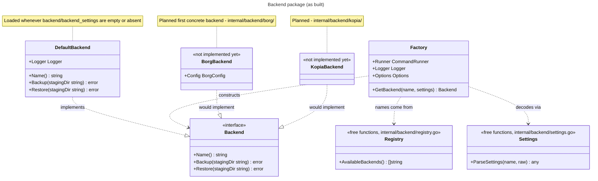

As a User, I want to be able to connect my `backup` and `restore` to a Backup Backend like `Borg`, `Kopia` or `rsync`.

## Status

Implemented (this document reflects the actual code, not just the original ask):

- `../internal/backend` — the `Backend` interface, `DefaultBackend`, `Factory`, `AvailableBackends()`, `ParseSettings`.
- `internal/shared.DackupConfig` — optional `Backend`/`BackendSettings` fields.
- `dackup backend` — the `create`/`show`/`update`/`remove` CRUD command.

Not implemented yet:

- No concrete backend (Borg, Kopia, rsync-as-backend, ...). `AvailableBackends()` returns an empty list, so `dackup backend create`/`update` currently just report that nothing is implemented rather than writing anything.
- No wiring into `dackup backup`/`dackup restore`. `shared.TransferService.Run` (the rsync staging copy) is still the entire operation those commands perform; nothing calls `Factory.GetBackend` outside of `../cmd/backend` and tests.

## One interface, not one per direction

The original idea sketched a `IBackend` interface with `Backup()`/`Restore()`. The as-built interface keeps that shape but is named `Backend` (idiomatic Go — no `I` prefix), and stays a single merged interface rather than splitting into separate backup/restore interfaces, so one backend implementation only ever has one type to satisfy:

```go
type Backend interface {
    Name() string
    Backup(stagingDir string) error
    Restore(stagingDir string) error
}
```

`DefaultBackend` is the no-op implementation loaded whenever no backend is configured. Its `Name()` returns `"none"`, but that string is **display-only** (printed by `dackup backend show`) — it is never written to the config file. The only "no backend configured" state is an empty/absent `backend` field.

## Config file shape

Saved on the main config file (`~/.config/dackup/config.json` by default), alongside `user`/`group`/the dir defaults — same file, no separate backend config file:

```json
{
  "backend": "backendName",
  "backend_settings": {
    "setting1": "setting",
    "setting2": "setting"
  }
}
```

Both fields are optional (`omitempty` on `shared.DackupConfig`). A config with neither field is valid — it's how every config looks today, since no concrete backend exists yet to select. `backend_settings` is stored as opaque raw JSON in `../internal/shared` (`json.RawMessage`); `../internal/shared` never inspects it beyond passing the bytes through, so adding a backend never changes `DackupConfig`'s shape.

## How a concrete backend gets resolved

Two separate dispatch points, both switching on the backend name, exist so that adding a backend is "add a subpackage, register its name, add one case to each":

- `../internal/backend/registry.go` — `AvailableBackends() []string` lists the names selectable via `dackup backend create`/`update`. Currently returns nothing.
- `../internal/backend/settings.go` — `ParseSettings(name string, raw json.RawMessage) (any, error)` decodes `backend_settings` into the matching backend's own typed `Config` struct (e.g. a future `borg.Config`). For `""` it returns `nil, nil`; any other name today is `"unknown backend"`.
- `../internal/backend/factory.go` — `Factory.GetBackend(name string, settings json.RawMessage) (Backend, error)` is the actual construction entry point: given a name and its raw settings, it returns a ready-to-use `Backend`. It carries the same dependencies `shared.TransferService` takes (`CommandRunner`, `Logger`, `Options`) so a real backend's constructor slots in without changing the factory's signature. `""` resolves to `DefaultBackend{Logger: factory.Logger}`; any other name today is an error, since nothing is registered.

Note that `dackup backend create`/`update` do **not** call `ParseSettings` or `Factory.GetBackend` — those two only matter once something actually needs a live `Backend` to call `Backup()`/`Restore()` on (i.e. once `../cmd/backup`/`../cmd/restore` are wired up). The CRUD command's own settings-prompt switch (in `../cmd/backend`, not `../internal/backend`) is what gathers `backend_settings` interactively before writing the config — kept out of `../internal/backend` the same way all container prompting lives in `../cmd/config`, not `../internal/shared`.



## `dackup backend` CRUD command

Backend config is a singleton value inside the existing main config file, not a list, so the CRUD verbs map to:

- `create` — errors if the main config file doesn't exist yet (points at `dackup config init`). If a backend is already configured, prompts to overwrite (default no). Then picks a name from `AvailableBackends()` and prompts for its settings — today that list is empty, so it prints "No backends are implemented yet" and writes nothing.
- `show` — read-only, no prompts. Prints the configured backend name and pretty-printed settings, or "No backend configured (using the default no-op backend)".
- `update` — errors if no backend is currently configured yet (points at `create`); otherwise same selection flow as `create`, overwriting the existing value.
- `remove` — errors if no backend is currently configured; otherwise confirms (default no) and clears `backend`/`backend_settings` back to unset.

All four go through the existing `shared.WriteDackupConfig`, so `--dry-run` previews the write instead of performing it, same as every other config-writing command.

## Folder structure (current)

```text
.
├── cmd
│   └── backend
│       ├── backend.go
│       └── backend_test.go
└── internal
    └── backend
        ├── backend.go
        ├── backend_test.go
        ├── factory.go
        ├── factory_test.go
        ├── registry.go
        ├── registry_test.go
        ├── settings.go
        └── settings_test.go
```

Planned, once a first concrete backend lands:

```text
internal/backend/borg/
├── borg.go     # Config, DefaultConfig(), Validate(), ParseConfig(), Backend implementation
└── borg_test.go
```

## Wiring into backup/restore (future work)

Once a concrete backend exists, `../cmd/backup` and `../cmd/restore` build a `Factory` (same way they build a `TransferService` today), resolve the configured `Backend` via `Factory.GetBackend(config.Backend, config.BackendSettings)`, and call into it after staging:

- `backup`: stop containers → stage (`TransferService`) → start containers → `backend.Backup(stagingDir)`.
- `restore`: `backend.Restore(stagingDir)` → stop containers → stage → fix ownership → start containers.

Neither of these calls exists in `../cmd/backup`/`../cmd/restore` yet — `TransferService.Run` remains the entire operation those commands perform.
